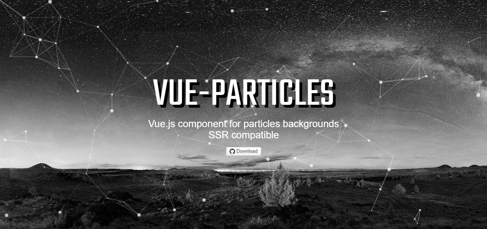

## 官网
[http://vue-particles.netlify.com/](http://vue-particles.netlify.com/)

## 使用方法
~~~
npm install vue-particles --save-dev
~~~

main.js里加入以下代码：
~~~
import VueParticles from 'vue-particles'  
Vue.use(VueParticles)  
~~~

App.vue 文件——一个完整的例子：
~~~
<template>
  

    <vue-particles
        color="#fff"
        :particleOpacity="0.7"
        :particlesNumber="60"
        shapeType="circle"
        :particleSize="4"
        linesColor="#fff"
        :linesWidth="1"
        :lineLinked="true"
        :lineOpacity="0.4"
        :linesDistance="150"
        :moveSpeed="2"
        :hoverEffect="true"
        hoverMode="grab"
        :clickEffect="true"
        clickMode="push"
        class="lizi"
      >
      </vue-particles>
    <router-view></router-view>
  

</template>
/*如果想做背景图片 可以给标签一个class 直接添加背景图*/
~~~

可配置属性：
* color: String类型。默认'#dedede'。 粒子颜色。
* particleOpacity: Number类型。默认0.7。 粒子透明度。
* particlesNumber: Number类型。默认80。 粒子数量。
* shapeType: String类型。默认'circle'。 可用的粒子外观类型有："circle","edge","triangle", "polygon","star"。
* particleSize: Number类型。默认80。 单个粒子大小。
* linesColor: String类型。默认'#dedede'。 线条颜色。
* linesWidth: Number类型。默认1。 线条宽度。
* lineLinked: 布尔类型。默认true。 连接线是否可用。
* lineOpacity: Number类型。默认0.4。 线条透明度。
* linesDistance: Number类型。默认150。 线条距离。
* moveSpeed: Number类型。默认3。 粒子运动速度。
* hoverEffect: 布尔类型。默认true。 是否有hover特效。
* hoverMode: String类型。默认true。 可用的hover模式有: "grab", "repulse", "bubble"。
* clickEffect: 布尔类型。默认true。 是否有click特效。
* clickMode: String类型。默认true。 可用的click模式有: "push", "remove", "repulse", "bubble"。

